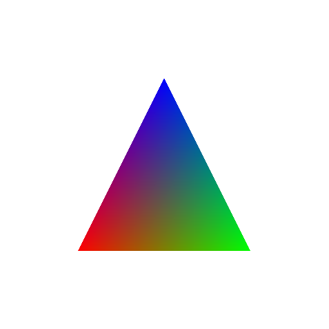
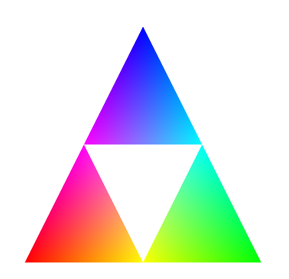

# OpenGL Learning

Repositório de estudos em OpenGL utilizando Python e GLFW.

---

## Estrutura do repositório

- Cada arquivo representa um experimento ou etapa do aprendizado.
- A pasta `IMAGENS/` contém apenas imagens dos resultados considerados relevantes.
- Este README registra somente os principais resultados visuais.

---

## Triângulo Colorido

- Desenho de um triângulo na tela
- Aplicação de cores
- Primeiro contato com o pipeline de renderização

---

## Triângulos Interpolados

- Teoria da Interpolação
- Modificação de atributos

